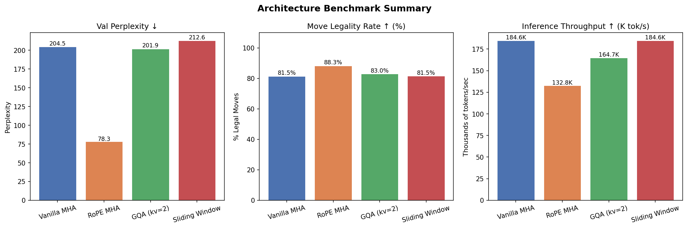
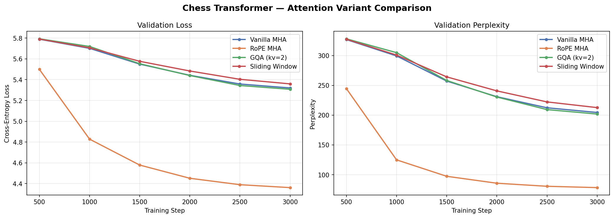
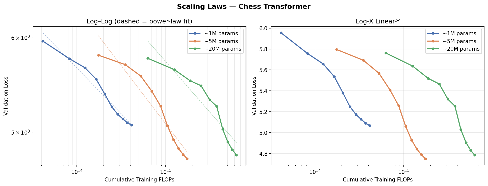
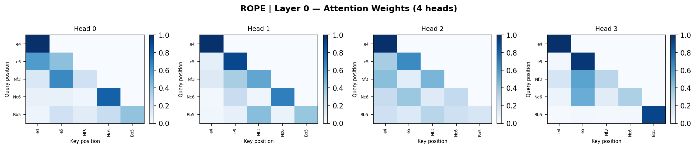
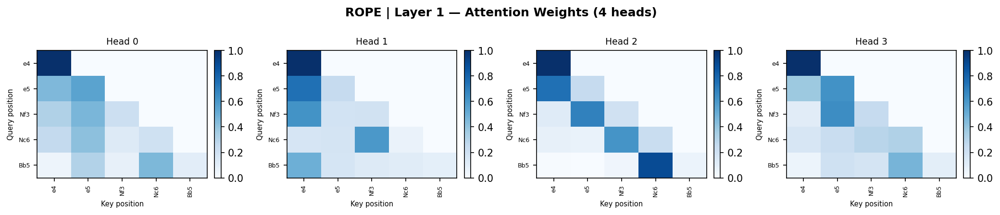
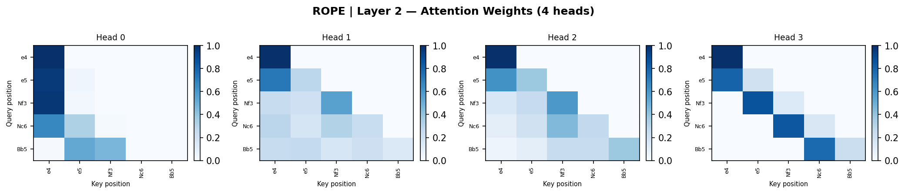
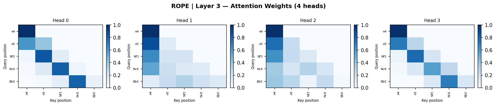

# Controlled Transformer Ablation — Chess PGN

> Implemented a transformer from scratch in PyTorch with RoPE, GQA, and sparse attention variants, trained on 120K chess games — benchmarked architecture tradeoffs across perplexity, memory, and move legality rate.

[](https://colab.research.google.com/github/matiimonti/Transformer_project/blob/main/notebooks/train_gpu.ipynb)

---

## Overview

A controlled comparison of four transformer attention variants, all trained on identical settings (same data, same hyperparameters, same compute budget) so the results isolate the effect of each architectural choice.

**Dataset:** 120,266 Lichess rated games (2013-01) · Vocabulary: 4,782 tokens
**Hardware:** NVIDIA T4 GPU · **Training:** 3,000 steps, cosine LR decay with warmup

---

## Benchmark Results

| Variant | Params | Val Loss | Perplexity | Move Legality | Tok/s |
|---|---|---|---|---|---|
| Vanilla MHA | 1,400,832 | 5.3204 | 204.47 | 81.5% | 184,629 |
| **RoPE MHA** | **1,400,832** | **4.3611** | **78.34** | **88.3%** | 132,760 |
| GQA (kv\_heads=2) | 1,335,296 | 5.3075 | 201.85 | 83.0% | 164,689 |
| Sliding Window | 1,400,832 | 5.3596 | 212.65 | 81.5% | 184,579 |

**Move legality** is measured by generating 100 games with python-chess and computing the fraction of moves that are legal at the point they are played. It is a domain-specific eval that goes beyond perplexity.

> Full analysis and takeaways: [RESULTS.md](RESULTS.md)

### Key findings

- **RoPE is the best one** — 2.6× lower perplexity (78.34 vs 204.47) and +6.8pp legality over vanilla MHA with identical parameter count. Chess moves have strong relative-position dependencies (what happened 2–4 moves ago matters); RoPE captures this through rotation rather than absolute position encoding.
- **GQA** — 4.7% fewer parameters, essentially identical quality to vanilla MHA. The right choice when inference memory matters: KV cache shrinks by `n_heads / kv_heads = 2×` with no measurable quality cost.
- **Sliding Window** — matches vanilla MHA, as expected. True compute savings require custom CUDA kernels (Longformer, Flash Attention); a dense mask with `-inf` in PyTorch reduces quality without reducing FLOPs.
- **torch.compile on T4** — measured 0.90× speedup (marginally slower) due to insufficient SMs for the most aggressive kernel autotune. Compile gains are more pronounced on A100/H100.

### Result Figures







**Attention head heatmaps** — what each head attends to on a Ruy Lopez opening (`e4 e5 Nf3 Nc6 Bb5`):

| Layer 0 | Layer 1 |
|---|---|
|  |  |

| Layer 2 | Layer 3 |
|---|---|
|  |  |

---

## Architecture

```
Input tokens
    │
    ▼
Token Embedding + Positional Encoding (sinusoidal or RoPE)
    │
    ▼  ×N layers
┌─────────────────────────────┐
│  Pre-LN                     │
│  Multi-Head Attention        │  ← swappable: MHA / RoPE / GQA / SWA
│  + Residual                 │
│  Pre-LN                     │
│  Feed-Forward (GELU)        │
│  + Residual                 │
└─────────────────────────────┘
    │
    ▼
Layer Norm → Output Projection (weight-tied to embedding)
    │
    ▼
Logits over vocabulary
```

**Hyperparameters used in benchmark:**
`d_model=128 · n_heads=4 · n_layers=4 · seq_len=128 · batch_size=64`
`max_lr=3e-4 · warmup_steps=300 · cosine decay to 3e-5`

---

## Attention Variants

### Vanilla MHA (`src/attention.py`)
Standard scaled dot-product attention with causal mask and sinusoidal positional encoding. Baseline for all comparisons.

### RoPE MHA
Position is encoded by **rotating** query and key vectors before the dot product, rather than adding a fixed vector to the input. Used in LLaMA, Gemma, Mistral. Gives better relative-position awareness (particularly useful for sequential data like chess).

### Grouped Query Attention (GQA)
Fewer K/V heads than Q heads (`kv_heads=2`, `n_heads=4`). Each K/V head is shared by `n_heads // kv_heads = 2` query heads. Used in LLaMA-2 70B, Mistral 7B, Falcon. Reduces KV-cache memory at inference by `n_heads / kv_heads`.

- `kv_heads == n_heads` → standard MHA
- `kv_heads == 1` → Multi-Query Attention (MQA)

### Sliding Window Attention
Each token attends only to the previous `window_size=32` tokens. Reduces theoretical complexity from O(T²) to O(T·W). Used in Longformer, BigBird, Mistral.

---

## Sample Generated Games

Generated by the RoPE model (`temperature=0.8, top_k=40`):

```
Game 1: e4 e5 Nf3 Nc6 Bb5 Bd7 Bxc6 bxc6 Be2 Nf6 O-O Bc5 Nc3 O-O h3 d5 d3 dxe4 dxe4 Nxe5 ...
Game 2: d4 d6 c4 Nf6 Nc3 g6 e4 Bg7 Nf3 O-O Bd3 c5 d5 a6 b4 b6 a3 Bb7 b3 b5 Nxb5 cxb5 ...
Game 3: e4 b6 d4 Bb7 Nc3 e6 Nf3 Bb4 Bd3 Bb7 O-O Nc6 c3 Bxc3 bxc3 f6 h3 f5 exf5 Bxf5 ...
Game 4: d4 d5 c4 dxc4 Nc3 Nf6 Nf3 e6 h3 Be7 e3 O-O Bd3 Nbd7 Qd2 c5 O-O a6 e4 e5 ...
Game 5: e4 e5 Nf3 Nc6 Bb5 a6 Bxc6 bxc6 d3 Nf6 O-O d5 exd5 Nxd5 Re1 Bd6 c3 Be6 Bg5 h6 ...
```

Sequences open with recognisable patterns (Ruy López exchange, King's Indian, English) and maintain legal play well into the middlegame.

---

## Project Structure

```
├── src/
│   ├── attention.py      # All 4 attention variants + KV cache
│   ├── model.py          # ChessTransformer (attention-agnostic via factory)
│   ├── pgn_data.py       # PGN parser, tokenizer, Dataset
│   └── visualize.py      # Attention head heatmap utilities
├── tests/
│   ├── conftest.py
│   ├── test_attention.py # Causal mask, RoPE, GQA, KV cache, sliding window
│   ├── test_data.py      # PGN parser, tokenizer round-trip, Dataset
│   └── test_model.py     # Forward pass, generation, weight tying, KV cache
├── train.py              # Training loop (LR schedule, checkpointing, wandb, early stopping)
├── benchmark.py          # Throughput measurement, torch.compile() speedup, plots
├── scale.py              # Scaling law experiment (1M / 5M / 20M param models)
├── notebooks/
│   └── train_gpu.ipynb        # Full training + benchmark (Colab GPU)
└── requirements.txt
```

---

## Reproducing the Results

```bash
git clone https://github.com/matiimonti/Transformer_project
cd Transformer_project
pip install -r requirements.txt

# Download data (Lichess open database — pick any month)
# https://database.lichess.org/ → decompress → save as data/games.pgn

# Run unit tests (no data needed, ~5s on CPU)
pytest tests/ -v

# Train all variants
for variant in vanilla rope gqa sparse; do
    python train.py --variant $variant --max_steps 3000
done

# Generate benchmark plots
python benchmark.py --checkpoint_dir checkpoints

# Scaling law experiment (trains 3 model sizes, ~3× training time)
python scale.py --pgn_path data/games.pgn --max_steps 3000

# Train with experiment tracking (requires: pip install wandb && wandb login)
python train.py --variant rope --max_steps 3000 --wandb

# Train with gradient accumulation (effective batch = 64 × 4 = 256)
python train.py --variant rope --max_steps 3000 --gradient_accumulation_steps 4

# Train with early stopping
python train.py --variant rope --max_steps 5000 --patience 5

# Compile model for faster training (PyTorch 2.0+, CUDA recommended)
python train.py --variant rope --max_steps 3000 --compile
```

Or run `notebooks/train_gpu.ipynb` end-to-end on **Google Colab (T4 GPU)** — includes data download, training, benchmarking, and game generation.

---

## Design Notes

**Why chess PGN?** Moves like `e4`, `Nf3`, `O-O` tokenize trivially (vocab ~2,000–5,000), the dataset is free and clean, and move legality gives a concrete domain-specific eval metric beyond perplexity.

**Dependency Inversion for attention:** `ChessTransformer` never references a specific attention class. It receives an `attention_factory: Callable[[], nn.Module]` at construction time. Swapping variants requires changing one argument, not touching the model.

**KV Cache:** All attention variants support `use_cache=True` in `generate()`. The prefill step processes the full prompt once; each decode step processes only the single new token — O(T) compute per step instead of O(T²). GQA stores the cache at the `kv_heads` dimension, directly demonstrating the memory saving. RoPE applies the correct positional `offset` during decode so each cached key keeps its absolute position.

**Weight tying:** The output projection shares weights with the token embedding matrix, following Press & Wolf (2017). Reduces parameters and improves generalisation.

**Pre-LN over Post-LN:** Layer norm before the attention/FFN sublayers (Pre-LN) gives more stable gradients and removes the need for learning rate warmup sensitivity.

**Gradient accumulation:** `--gradient_accumulation_steps N` gives effective batch size `batch_size × N` without increasing GPU memory. The loss is divided before `.backward()` so gradients are averaged, not summed.
